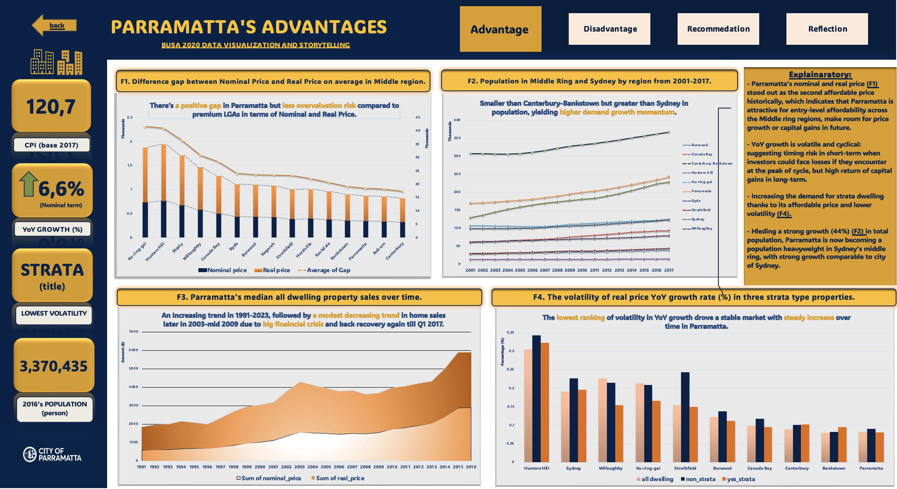
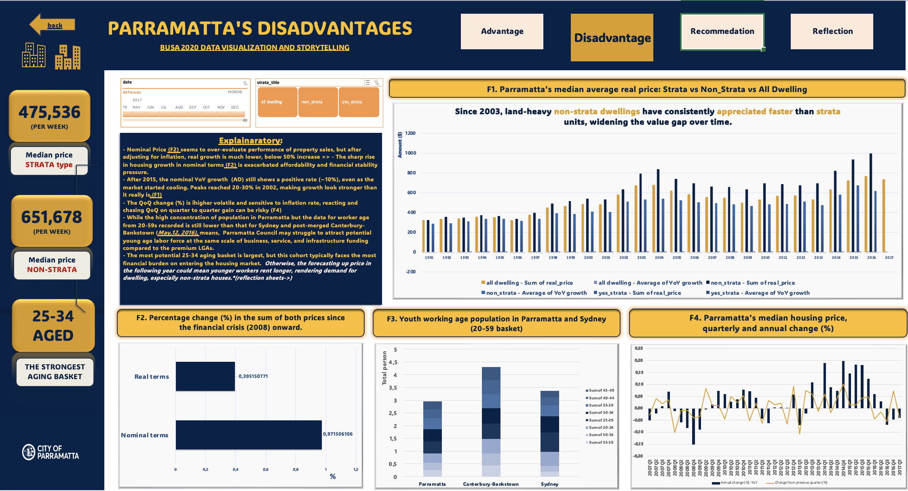
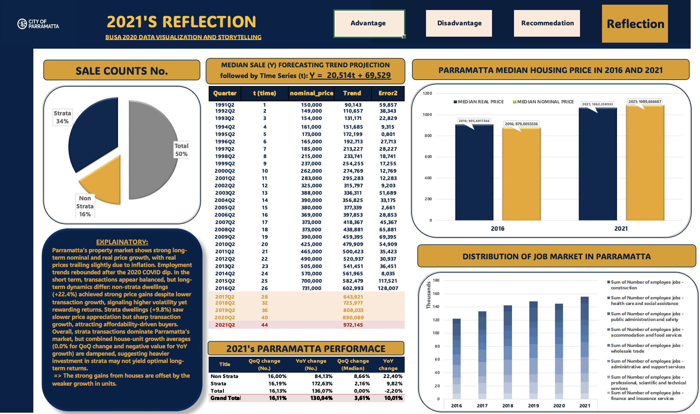

# Parramatta Housing Investment Analysis
### 30-Year Market Study & Buy/Hold Recommendation

**Is Parramatta a sound property investment relative to Sydney's premium LGAs and what does 30 years of data say about timing?**

---

### Business Context
Property investors comparing Sydney LGAs face a tradeoff: premium suburbs (Ku-ring-gai, Hunters Hill, Manly) carry higher overvaluation risk, while outer suburbs may lack growth momentum. This analysis models 30 years of median housing price, population, and employment data to test whether Parramatta offers a genuinely defensible middle ground and delivers a clear buy/hold call, not just a market description.

### What I did
- Modelled nominal vs. real price gaps across 11 Sydney LGAs to isolate overvaluation risk from genuine capital growth
- Built a quarterly time-series forecast (linear trend) on Parramatta median sale price, 1991–2021, and validated it against actual 2021 outcomes
- Compared strata vs. non-strata price appreciation to separate unit-market from house-market dynamics
- Cross-referenced population and youth working-age labour supply trends to assess demand durability, not just historical price
- Delivered the analysis as an interactive Excel dashboard (Pivot Tables, dynamic charts) so a non-technical stakeholder could explore assumptions independently

### Key findings & recommendation

**1. Parramatta shows a smaller nominal-real price gap than premium LGAs lower overvaluation risk.**

Compared to Ku-ring-gai, Hunters Hill, and Manly, Parramatta's nominal-to-real price gap is narrower, and it recorded the **lowest volatility in YoY growth rate** of the 10 LGAs compared.
→ Lower volatility means fewer scenarios where an investor buys near a local peak and is stuck underwater.

**2. Population growth signals durable, not speculative, demand.** 

Parramatta's population grew ~44% in the period studied -> outpacing Sydney overall and trailing only Canterbury-Bankstown among comparable middle-ring LGAs.
→ Demand growth this broad-based is a stronger buy signal than a short-term price spike.

**3. Houses are outpacing units >> a market-segment risk, not a Parramatta-specific one.** 

Since 2003, non-strata (house) dwellings have appreciated consistently faster than strata (unit) dwellings, widening the value gap; combined market growth is dampened because strata transactions dominate volume.
→ Practical implication: the "Parramatta is a good investment" call is stronger for non-strata property specifically; unit buyers should expect slower capital growth.

**4. Forecast model validated against real outcomes.** 

A linear trend model (median price = 20,514×t + 69,529, fit on 1991–2016 quarterly data) projected ~$972,145 for Q2 2021. Actual 2021 nominal median price came in at $1,089,667, the model underestimated the actual outcome, meaning the market outperformed a conservative linear trend rather than falling short of it.
→ This is a meaningful check on the analysis itself: the forecast wasn't just descriptive, it was tested against what actually happened.

**5. One risk flag: youth working-age labour supply is comparatively thin.** 

Parramatta's 20–59 working-age population is lower than Sydney's and Canterbury-Bankstown's, with the largest cohort sitting in the 25–34 "aging basket", this is the group facing the steepest affordability burden entering the market.
→ Longer-term demand depends on Parramatta continuing to attract this cohort via jobs and infrastructure investment, not assumed by default.

**Investment recommendation: INVEST.** The preferred profile for a property market is moderate, consistent, positive real price YoY growth (roughly 3–6% annually). It's not erratic spikes or long-term decline, since that combination signals sustainable demand and healthier fundamentals with lower risk. Parramatta's growth and volatility profile across this dataset fits that band, particularly for non-strata property.

### Dashboard preview

[Full investment report (PDF)](output/Housing%20property%20analysis%20report.pdf)

### Limitations
- One population figure in the dashboard (3,370,435) reflects the broader Sydney statistical area, not Parramatta LGA specifically — noted here to avoid misreading it as a suburb-level figure.
- Forecast model is a simple linear trend; it doesn't account for policy shocks (rate changes, planning reform) or structural breaks like COVID-era distortions.
- Strata/non-strata comparison is Parramatta-specific; the general pattern (houses outpacing units) may not generalize to all Sydney LGAs.

### Tools used
Excel (Pivot Tables, dynamic dashboards, forecasting) · Time-series trend modelling

---
### Author

**Quynh Huong Nguyen (Sylvie)**

Macquarie Business School

[LinkedIn](https://www.linkedin.com/in/sylvia-quin/) · 📧 [Email](huongquynh04.vn@gmail.com)
